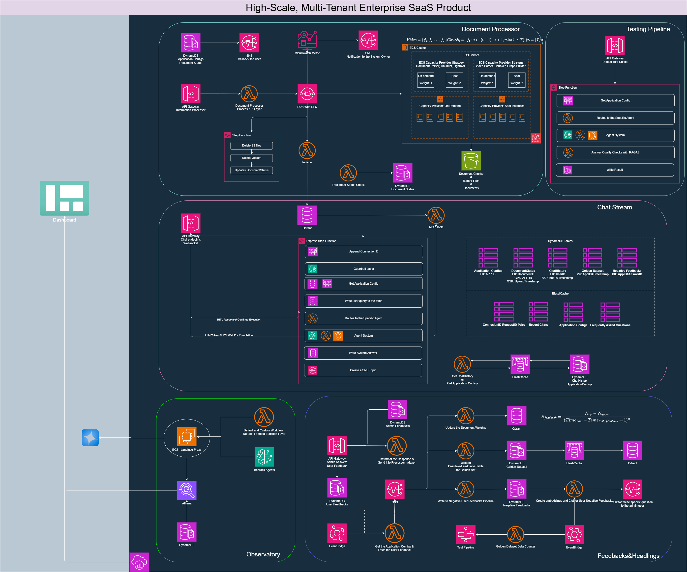

# High-Scale Multi-Tenant Enterprise SaaS Architecture

## Overview
Enterprise-grade SaaS platform architecture designed for high-scale, multi-tenant operations with comprehensive document processing, real-time communication, and monitoring capabilities.

## Core Components

### Document Processor
- Automated document ingestion and processing pipeline
- ECS-based microservices for document parsing and classification
- S3 storage with weighted distribution across capacity providers
- Testing pipeline with quality checks and agent validation

### Chat Stream
- Real-time messaging infrastructure using API Gateway WebSocket
- DynamoDB tables for connection management and message persistence
- ElastiCache layer for high-performance data access
- Lambda-based event processing and routing

### Observatory
- Centralized monitoring and logging system
- Lambda functions for metrics collection and analysis
- EC2-based long-running analysis jobs
- DynamoDB for persistent observability data

### Feedbacks & Headings
- User feedback collection and processing pipeline
- EventBridge for event-driven architecture
- Lambda functions for feedback analysis and routing
- S3 storage for feedback artifacts

## Technology Stack
- **Compute**: AWS Lambda, ECS, EC2
- **Storage**: S3, DynamoDB
- **Networking**: API Gateway (REST & WebSocket), VPC
- **Caching**: ElastiCache
- **Orchestration**: EventBridge, Step Functions
- **Frontend**: Dashboard interface

## Architecture Highlights
- Event-driven microservices design
- Serverless-first approach for scalability
- Multi-tenant isolation and security
- Horizontal scaling capabilities across all services
